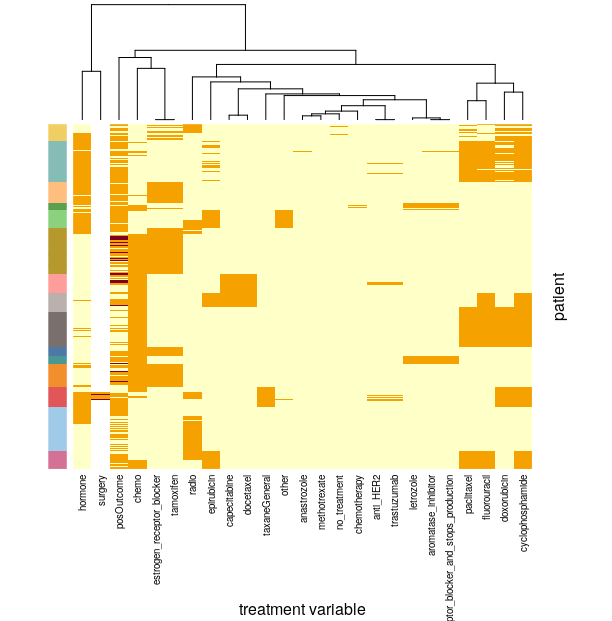

# OpenCog/SNet precision medicine for clinical trials poc project
## Questions to answer:
- what patterns of patient biomarkers characterize treatment success?
- what patterns of patient biomarkers characterize adverse events?
- what combination of biomarkers and treatment parameters characterize best patient outcomes?

## Breast, ovarian, and pancreatic cancer tumor transcriptomes and clinical data sets
Each cancer set has data from multiple studies with different gene sets and clincal variables that can be analyzed as an ensemble/meta-analysis or merged into one large matrix.  Meta-analysis is more powerful with standard statistical methods due to data loss when variables from different studies are aligned and merged.
## Data sources
**curatedBreastData**  4,923 breast tumor microarray expression sets from 2,613 patients in 20 studies [[paper](https://www.ncbi.nlm.nih.gov/pubmed/24303324)] [[github](https://github.com/kplaney/curatedBreastCancer)].  Related files have **bc** prefix  
  
**MetaGxBreast** in progress  
**MetaGxOvarian** in progress  
**MetaGxPancreas** in progress  
  
[MetaGxData: Clinically Annotated Breast, Ovarian and Pancreatic Cancer Datasets and Their Use in Generating a Multi-Cancer Gene Signature](https://pubmed.ncbi.nlm.nih.gov/31217513/)  

**pdf copies of papers are in the [lit](./lit) dircetory**  

## Breast Cancer data set
### [bcTabs.ods](./data/bcTabs.ods)
**bcVarDesc** -  description of all clinical variables with type annotations:
- **study:**  variables indicating membership in a specific study set or batch
- **patient:**  variables associated with individual patients
- **treatment:**  variables associated with treatment
- **state:**  variables associated with patient condition.  these have a **time** annotation indicating if the state was measured before or after treatment

**bcCovariateVars** - variables with patient demographics, medical history, miscellaneous clinical features and study information  
**bcTreatmentVars** - treatment drug and drug type variables  
**bcOutcomeVars** - treatment outcome variables including including time to event data  
**bcClinicalTable** - dump of clinical variables for all patients in breast cancer data set  

### Gene Expression data
 [**example15bmc**](https://s3.console.aws.amazon.com/s3/buckets/snet-bio-data/example15bmc/example15bmc/?region=us-west-2&tab=overview) - subset of patients from 15 studies (2 studies are divided into 2 batches so 17 expression level files) with at least 3 years of post-treatment follow up  
 [**merged-combat15.csv.xz**]( https://snet-bio-data.s3-us-west-2.amazonaws.com/example15bmc/merged-combat15.csv.xz) - the 15 studies above combined using empirical bayes normalization as implemented by the `ComBat` function of the `sva` Bioconductor package of expression values leaving 8,832 overlapping genes (studies range from 12,722 to 18,260 genes).  

### Initial ML data set
For initial supervised ML pipeline experiments, a set of composite binary treatment and outcome variables [[bmc15mlData1.csv]](./data/bcDump/example15bmc/bmc15mlData1.csv) has been constructed to combine with the subset of expression data sets or the merged expression dataset described in the previous section.  
### `bmc15mldata`
`study` - csv file name containing sample expression data  
`patient_ID` - key to match clinical, expression and outcome data  
  
**binary treatment variables**
- `radio` - radiotherapy (442/2225)
- `surgery` - breast sparing vs mastectomy (144/2225)
- `hormone` - hormone therapy (855/2225)
- `chemo` - chemotherapy (1186/2225)
  
**outcome variables**
- `pCR` - complete remission by pathology (260/1134)
- `RFS` - relapse free survival (736/1030)
- `DFS` - disease free survival (512/656)
- `posOutcome` - any of the above are positive (1386/2225)  

One or more treatment variables and an outcome variable should be selected and combined with the individual or merged expression datasets using `patient_ID` as the key.

  
The heatmap of granular drug type variables shows hormone based treatment regimens clustering on the left and chemotherapy regimens on the right.  The color bar on the left shows which the study the patient is from.
## additional data and method sources
### Clustering Intra and Inter DatasEts
CoINcIDE is an unsupervised graph clustering algorithm used to categorize tumor types based on gene expression profiles: [paper](https://www.ncbi.nlm.nih.gov/pubmed/26961683), author's  [github](https://github.com/kplaney/CoINcIDE).  
The author's github includes useful but outdated R code for processing and merging microarray data sets from [GEO](https://www.ncbi.nlm.nih.gov/geo/). Updating the code for current use is ongoing, see _cancer_ branch of fork of author's github repository in [_CoINcIDE_](https://github.com/mjsduncan/CoINcIDE/tree/cancer).  

[Link](https://www.ncbi.nlm.nih.gov/pubmed?linkname=pubmed_pubmed_citedin&from_uid=26961683) to papers citing CoINcIDE in pubmed for current related research in precision medicine.
  
state of the art tumor classification: [Dynamic Classification Using Case-Specific Training Cohorts Outperforms Static Gene Expression Signatures in Breast Cancer](https://pubmed.ncbi.nlm.nih.gov/25274406/)

### TCGA
??? samples already included in breast cancer dataset  
[Link](https://www.nature.com/articles/nature11412) to multi-omics breast cancer sub-typing paper with analysis data available from TCGA.  This a good paper for understanding current thinking about breast cancer.  
TCGA pan-cancer literature [index](https://www.cell.com/pb-assets/consortium/pancanceratlas/pancani3/index.html)  
  
163 normal tissue cases bc [search table](https://portal.gdc.cancer.gov/exploration?facetTab=cases&filters=%7B%22op%22%3A%22and%22%2C%22content%22%3A%5B%7B%22op%22%3A%22in%22%2C%22content%22%3A%7B%22field%22%3A%22cases.primary_site%22%2C%22value%22%3A%5B%22breast%22%5D%7D%7D%2C%7B%22op%22%3A%22in%22%2C%22content%22%3A%7B%22field%22%3A%22cases.samples.sample_type%22%2C%22value%22%3A%5B%22solid%20tissue%20normal%22%5D%7D%7D%5D%7D)  
1,145 blood samples bc [search table](https://portal.gdc.cancer.gov/exploration?facetTab=cases&filters=%7B%22op%22%3A%22and%22%2C%22content%22%3A%5B%7B%22op%22%3A%22in%22%2C%22content%22%3A%7B%22field%22%3A%22cases.primary_site%22%2C%22value%22%3A%5B%22breast%22%5D%7D%7D%2C%7B%22op%22%3A%22in%22%2C%22content%22%3A%7B%22field%22%3A%22cases.samples.sample_type%22%2C%22value%22%3A%5B%22blood%20derived%20normal%22%5D%7D%7D%5D%7D)

### other data and methods links
- [MetaGxData: Clinically Annotated Breast, Ovarian and Pancreatic Cancer Datasets and Their Use in Generating a Multi-Cancer Gene Signature](https://pubmed.ncbi.nlm.nih.gov/31217513/)  
- [Integration of RNA-Seq Data With Heterogeneous Microarray Data for Breast Cancer Profiling](https://pubmed.ncbi.nlm.nih.gov/29157215/)  
- [Mining Data and Metadata From the Gene Expression Omnibus](https://pubmed.ncbi.nlm.nih.gov/30594974/)  
- [Tree-Weighting for Multi-Study Ensemble Learners](https://pubmed.ncbi.nlm.nih.gov/31797618/)
- [OncoKB: A Precision Oncology Knowledge Base](https://pubmed.ncbi.nlm.nih.gov/28890946/)  
- [BioDataome: A Collection of Uniformly Preprocessed and Automatically Annotated Datasets for Data-Driven Biology](https://pubmed.ncbi.nlm.nih.gov/29688366/)
- [Microarray Meta-Analysis Database (M(2)DB): A Uniformly Pre-Processed, Quality Controlled, and Manually Curated Human Clinical Microarray Database](https://pubmed.ncbi.nlm.nih.gov/20698961/)
